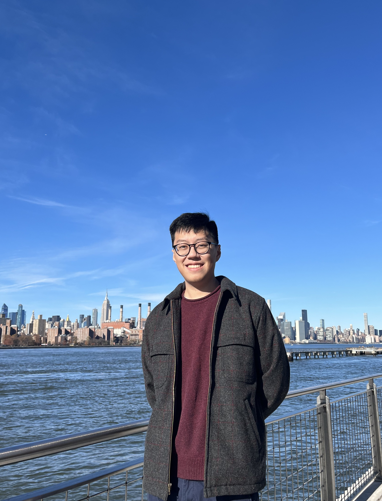

<nav class="toc" markdown="1">
 

<h1>Andrew Wang</h1>
* TOC
{:toc}
</nav>

About Me
--------

I am a Research Associate at Johns Hopkins University in the [Human Language Technology Center of Excellence](https://hltcoe.jhu.edu/). I am currently interested in controllable text generation, representation learning, and NLP for social good. Before that I worked with Prof. Yangfeng Ji at the University of Virginia in the [Information and Language Processing Lab](https://uvanlp.org/) where I earned an MS in computer science.  

Publications
------------

#### In Submission
- **Does Author Representation Learning Capture Stylistic Features?**  
Andrew Wang\*, Cristina Aggazzotti\*, Rebecca Kotula\*, Rafael Rivera Soto\*, Marcus Bishop, Nicholas Andrews   
*Transactions of the Association for Computational Linguistics (under review - Nov 2022)*  

#### Accepted

- **Sentence Level Embedding Detoxification via Toxic Component Removal**  
Andrew Wang (Advised by Yangfeng Ji)  
*Master's Thesis. April 2022.*
[link](https://doi.org/10.18130/5pch-v272)

- **Does Differential Privacy Impact Bias in Pretrained NLP Models?**  
Md. Khairul Islam\*, Andrew Wang\*, Jieyu Zhao, Yangfeng Ji, Tianhao Wang  
*4th AAAI Workshop on Privacy Preserving Artificial Intelligence. February 2023.* 

`*` denotes equal contribution

